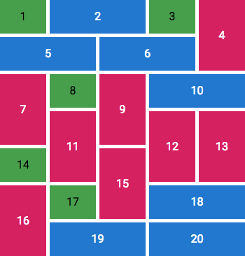

rectangular-mozaic
==================

> Rectangular mozaic generator library for PHP.

[][Packagist]
[][Packagist]
[][Travis CI]
[][Codecov]
[][Code Climate]

Description
-----------

Given a **number of tiles T**, and a **number of columns `Columns C`**, this library helps
generating a grid of `C` columns containing `T` tiles. Each tile will either:
- occupy 1 cell, or
- span over 2 cells vertically,
- span over 2 cells horizontally.

Note: as tiles are distributed randomly, number of lines may vary from one execution to another.

Demo
----

[][Œco Architectes Example]

Example at [Œco Architectes] (refresh the page to get a new layout):

[][Œco Architectes Example]

**Note:** all images belong to [Œco Architectes].

Installation
------------

Install using [Composer]:

```bash
composer require amercier/rectangular-mozaic
```

Usage
-----

In the following example, we will create a HTML `<table>` element containing `20` tiles.

> **Note:** we just use a table for simplicity here. For a real website, only use `<table>` for tabular data.

```php
<?php

use \RectangularMozaic\Generator as Mozaic;
use \RectangularMozaic\Cell;

$tilesNumber = 20;
$columns = 5;

$grid = Mozaic::generate($tilesNumber, $columns);

echo '<table>';
$i = 1;
foreach ($grid->getCells() as $row) {
    echo '<tr>';
    foreach ($row as $cell) {
        switch ($cell) {
            case Cell::SMALL:
                echo '<td>' . $i . '</td>';
                break;
            case Cell::TALL_TOP:
                echo '<td rowspan="2">' . $i . '</td>';
                break;
            case Cell::TALL_BOTTOM:
                break; // do nothing
            case Cell::WIDE_LEFT:
                echo '<td colspan="2">' . $i . '</td>';
                break;
            case Cell::WIDE_RIGHT:
                break; // do nothing
        }
        $i += 1;
    }
    echo '</tr>';
}
echo '</table>';
```

Example of generated tables:



To run this example, `git clone` this repository locally and run:
```sh
composer install
composer start
```

License
-------

[](LICENSE.md)

[Travis CI]: https://travis-ci.org/amercier/rectangular-mozaic
[Packagist]: https://packagist.org/packages/amercier/rectangular-mozaic
[Codecov]: https://codecov.io/gh/amercier/rectangular-mozaic
[Code Climate]: https://codeclimate.com/github/amercier/rectangular-mozaic
[Composer]: https://getcomposer.org/
[Œco Architectes]: https://www.oeco-architectes.com/
[Œco Architectes Example]: https://www.oeco-architectes.com/projets
